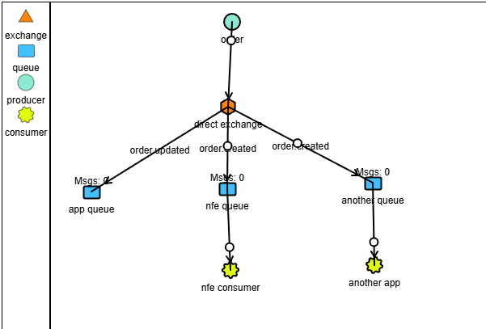

# Rabbit MQ

pra integrar o rabbit mq a uma aplicacao node usaremos a lib do [amqplib](https://www.npmjs.com/package/amqplib) 

## Rabbit mq utilizado

Pra facilitar eu to usando o plugin do docker desktop do rabbit mq e estou verificando com o usuario `guest` cuja senha e `guest` tambem

## Consideracoes ds aulas

- `assertQueue` - se nao tiver a fila ele cria uma, com indepotencia e durable sendo true por padrao (ele persiste a fila)

- Multiplos consumidores - por padrao se temos duas filas olhando pra mesma fila o rabbit mq ele divide o consumo da mensagem pras duas filas fazendo balanco de carga entre elas. E usado de forma paralela

    Problema de multiplos consumidores e que pode acontecer de dois consumidores receberem a mesma mensagem mas e garantido q vai receber ao menos uma vez. Pra isso precisa se trabalhar a indepotencia

- Consumidores enviam um sinal de consumo pras mensagens que foram lidas, esse sinal e o acknowlegment (padrao em comunicacoes tcp)

- queues - padrao de comunicacao assincrona - filas sao os meios de comunicacao da mensagem. filas primeiro que entra e o primeiro que sai

- 1 fila pode ter varios consumidores, que podem ser varias aplicacoes diferentes, varios usuarios diferentes

- exchanges - elas sao roteadores das mensagens, sao intermediarios e rotear mensagens pras filas, entao inves de publicarmos diretamente nas filas nos publicamos nas exchanges, que ficarao encarregadas de publicar pras inumeras filas associadas a elas

    o rabbit mq ja vem com exchanges padroes que vem com todos os tipos necessarios, questao e conhecer esses tipos

- app de visualizacao de mensagens - https://tryrabbitmq.com/

- os bidings sao responsabilidades de cada aplicacao consumidora

- ampq default e uma exchange do rabbit q eu nao posso excluir e toda fila por default faz um biding pra ela a prova disso e que a funcao send to queue e um wrapper pra publish com a exchange sendo vazia, esse vazio e o default sendo o ampq default

- a exchange do tipo fanout e uma exchange do tipo direct so que mais facil de manejar pra um numero grande de filas, sem precisar nomear as routing keys 

- exchange fanout - faz o broadcasting da informacao

- os topicos podem fazer com que suas routing keys sejam programadas de forma automatica com regex, tornando mais maleavel a gestao dos bindings

- exchange do tipo headers, e uma exchange do tipo topic que usa headers ao inves de routing keys e por ela eu posso passar qualquer informacao e pelos consumers eu faco o tracking normalmente pela tipagem dos parametros que passo pelos headers, eu faco comparacao por um parametro chamado `x-match` que tem as seguintes regras

       // se for all, todos os parametros devem bater
        // se for any, qualquer um dos parametros deve bater
        // se for all-with-x, todos os parametros devem bater, exceto os que comecam com x-
        // se for any-with-x, qualquer um dos parametros deve bater, exceto os que comecam com x-

## Confiabilidade e persistencia

- uma maxima de mensageria - nada e garantido, mensageria nao deixa de ser uma comunicacao de rede e redes falham

do producer pra exchange e da fila pro consumer posso ter falhas, assim como a confirmacao de volta (do acknowledge)

o ack pode ser feito do consumer pro rabbit mq como do rabbit mq pro producer

o ack usa rede tcp tambem entao aumentaria o tempo de latencia das suas aplicacoes

quando se passa um `noAck: false` nos estamos fazendo um consumer automatic acknowledgment. dessa forma o rabbit mq marca as mensagens como lidas

o modo padrao de envio de mensagens do broker e chamado de `fire and forget`, a mensagem e disparada mas depois nao e mais responsabilidade dela 

A desvantagem dessa abordagem: temos perda de mensagem, sem backpressure (fazer prefetch de mensagens nao lidas), nao tem retry e nem tolerancia a falhas

vantagem: menor complexidade, desempenho melhor (sem confirmacao nao tem recurso de rede), maior throughtput ou maior processamento de dados por seg

casos de uso - logs ou dashboards de uso dos recursos do sistema (nao tem problema ter perda desses dados), geoprocessamento (uber, nao tem problema de perder uma localizacao ou outra), transmissao de eventos em tempo real

quando precisa de confiabilidade: pagamentos ou dados financeiros (nao pode perder nada)

resumindo: manual (mais confiavel mais lento), automatica (mais rapida porem menos confiavel)

manual ack - se queremos confiabilidade de que o consumidor leu e processou o dado, obrigatoriamente teremos que fazer a confirmacao de modo manual e dessa forma confirmamos q nao teremos perda de mensagem, com o modo manual nao

caso usemos o manual ack e o broker enviou as mensagens pro consumer, nesse ponto essas mensagens passam de ready pra unacked, se acontecer algum erro no consumer ela volta pra ready, e o broker manda essas mensagens quantas vezes forem necessarias, faco o prefetch das mensagens e ate estarem ok e o fluxo poder correr

dados nao reprocessaveis - json invalido ou dados invalidos

reprocessaveis - banco de dados ta fora, bug no software, erros de rede - operacoes feitas com reject ou nack do protocolo ampq

marcar com reject, nack ou ack sao as regras que colocaremos no codigo pra processar a mensagem ou nao

- dead letter exchange - acontece de eu querer reprocessar uma mensagem que deu erro de processamento e ela ficar em loop infinito, gastando recursos de forma ineficiente
    dead letter e um conceito que vem dos correios - se o correio nao entrega a carta, por algum erro tipo o remente nao esta no endereco, ou o endereco esta errado entao eu tenho o conceito de carta morta

    existe uma exchange que sera encarregada de carregar essas cartas mortas (normalmente chamada de dlx), assim como uma fila morta tambem

    a abordagem da dead letter exchange e pra desencalhar a filha principal pra que uma hora ela seja processada e dar andamento  as mensagens que estejam funcionando